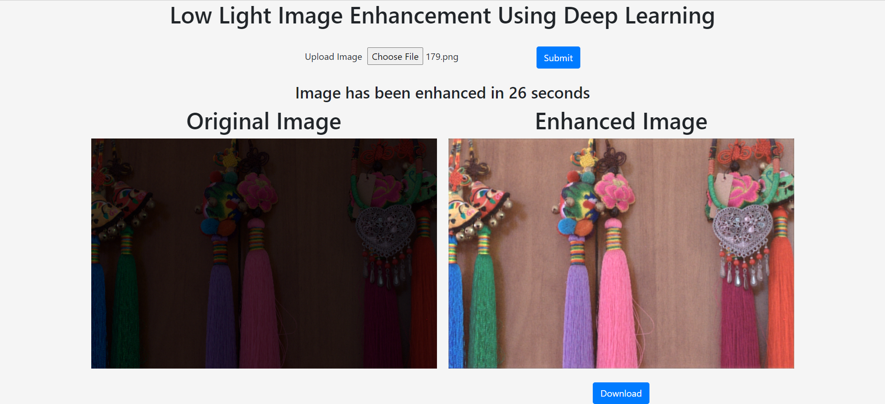

# Image-Editor

## Frontend:
* Navigate to the Frontend folder inside your terminal
* Run ```npm install```
* Run ```npm start```
* The server should be running at ```http://localhost:3000/```

## Backend:
* Create a virtualenv using ```py -m venv image_editor_env```
* Activate it using ```image_editor_env\Scripts\acivate``` on Windows 
* Run ```pip install -r "requirements.txt"```
* Finally navigate into the Backend folder and run ```py manage.py runserver```

## Screenshots:


## Developer Contact:
* Developed and maintained by Arihant Sheth
* Email: arihant.sheth0802@gmail.com
